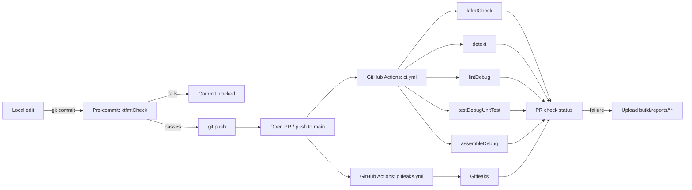

# CI/CD

This document describes the continuous integration and delivery pipeline for Luna: what runs where, why each tool was chosen, and how to extend it.

## Overview



The pipeline has two layers:

| Layer | Where | What it catches |
| --- | --- | --- |
| Pre-commit hook | Local machine | Unformatted Kotlin (fast, cheap) |
| GitHub Actions | Cloud (`ubuntu-latest`) | Style, code smells, Android-specific bugs, broken tests, build failures |

## Tooling

| Tool | Purpose | Where it runs | Config |
| --- | --- | --- | --- |
| **Ktfmt** (`com.ncorti.ktfmt.gradle`) | Kotlin formatter, Google Android style (2-space) | Local hook + CI | [`build.gradle.kts`](../build.gradle.kts) `subprojects` block |
| **Detekt** (`io.gitlab.arturbosch.detekt`) | Static analysis / code smells | CI | [`config/detekt/detekt.yml`](../config/detekt/detekt.yml) |
| **Android Lint** | Android-specific issues (UI, perf, security, deprecated APIs, target SDK) | CI | `android { lint { ... } }` in [`app/build.gradle.kts`](../app/build.gradle.kts) |
| **JUnit / Gradle test** | JVM unit tests | CI | `:app:testDebugUnitTest` |
| **GitHub Actions** | Orchestration | Cloud | [`.github/workflows/ci.yml`](../.github/workflows/ci.yml) |
| **Gitleaks** | Secret scanning (API keys, tokens, credentials) | CI | [`.github/workflows/gitleaks.yml`](../.github/workflows/gitleaks.yml) |
| **Dependabot** | Weekly dependency updates | GitHub | [`.github/dependabot.yml`](../.github/dependabot.yml) |

### Why these choices

- **Ktfmt over ktlint/Spotless** — Ktfmt is opinionated and deterministic; no rule-tuning loop. The Gradle plugin is purpose-built (cleaner than wrapping it in Spotless).
- **Google Android style (2-space)** — Matches AOSP / most Android samples; chosen at project start, so changing it later would produce a churny mega-diff.
- **Detekt with formatting rules off** — Formatting is owned by ktfmt; we disable Detekt's `formatting` ruleset and `NewLineAtEndOfFile` to avoid two tools fighting over whitespace.
- **Detekt with Compose carve-outs** — `FunctionNaming` is disabled because `@Composable` functions use `PascalCase`. `MagicNumber` is disabled because Compose UI code is unavoidably full of `0xFF...` colors and `dp`/`sp` literals.
- **`lint.abortOnError = true`, `warningsAsErrors = false`** — Lint errors block CI, but warnings remain warnings so we don't drown in noise from third-party libs.
- **Single CI job** — Cheaper than parallel jobs for a small codebase; Gradle's task graph + caching makes this fast.

## Local pre-commit hook

The hook is bash and lives at [`scripts/git-hooks/pre-commit`](../scripts/git-hooks/pre-commit):

```bash
#!/usr/bin/env bash
set -euo pipefail
./gradlew --quiet --no-daemon ktfmtCheck
```

It's installed automatically by the Gradle `installGitHooks` task, which is wired to `:app:preBuild` — i.e. the first time you run any build, the hook is copied into `.git/hooks/pre-commit` and made executable.

**Bypassing the hook** (only if you know what you're doing):

```bash
git commit --no-verify -m "..."
```

**Auto-fix and retry**:

```bash
./gradlew ktfmtFormat
git add -u && git commit ...
```

The hook only checks formatting (cheap, ~seconds). Heavier checks (detekt, lint, tests) intentionally stay on the CI server so commits don't take minutes.

## GitHub Actions workflow

File: [`.github/workflows/ci.yml`](../.github/workflows/ci.yml)

### Triggers

- `pull_request` (any branch)
- `push` to `main`

### Concurrency

```yaml
concurrency:
  group: ${{ github.workflow }}-${{ github.ref }}
  cancel-in-progress: true
```

Older runs on the same branch are cancelled when a new commit is pushed — saves Actions minutes on rapid pushes.

### Steps

1. **Checkout** — `actions/checkout@v6`
2. **JDK 21 (Temurin)** — `actions/setup-java@v5`. Matches the local Gradle toolchain (`gradle/gradle-daemon-jvm.properties`).
3. **Setup Gradle** — `gradle/actions/setup-gradle@v5`. Validates the Gradle wrapper, configures Gradle User Home caching (build cache + dependencies).
4. **Run checks** — one Gradle invocation so the task graph is shared:

   ```bash
   ./gradlew ktfmtCheck detekt lintDebug testDebugUnitTest assembleDebug
   ```

5. **Upload reports on failure** — `actions/upload-artifact@v7` collects everything under `**/build/reports/**` (Detekt HTML/SARIF, Lint HTML, JUnit XML, test HTML) so you can debug without re-running locally.

### Why Node 24-era action versions

All actions are pinned to majors that run on Node.js 24 (GitHub deprecated Node 20 in Sep 2026): `checkout@v6`, `setup-java@v5`, `setup-gradle@v5`, `upload-artifact@v7`. Dependabot will bump them when new majors land.

## Secret scanning (Gitleaks)

File: [`.github/workflows/gitleaks.yml`](../.github/workflows/gitleaks.yml)

Runs in parallel with the main `ci.yml` workflow so PRs get fast feedback even if Gradle is slow.

### Triggers

- `pull_request` (any branch) — scans the diff
- `push` to `main`
- Weekly schedule (Monday 06:00 UTC) — scans full history to catch anything that slipped in

`fetch-depth: 0` is set so Gitleaks can walk the full git history (its default behaviour for `push`/`schedule`).

### What it catches

API keys, OAuth tokens, AWS/GCP credentials, private keys, JWTs, etc. — based on Gitleaks' [default ruleset](https://github.com/gitleaks/gitleaks/blob/master/config/gitleaks.toml). No project-level config is needed for sensible defaults.

### Suppressing a false positive

If a "secret" is intentional (test fixture, public key, sample value), append `# gitleaks:allow` to the line. To globally allowlist a pattern, add a `.gitleaks.toml` at repo root — see the [Gitleaks docs](https://github.com/gitleaks/gitleaks#configuration).

### Note on the `gitleaks-action` license

`gitleaks/gitleaks-action@v2` is free for personal GitHub accounts. For **organization** accounts it requires a `GITLEAKS_LICENSE` secret (free OSS keys available, or paid plan). If this repo is moved under an org and the workflow starts failing with a license error, either:

- request a free OSS license at [gitleaks.io](https://gitleaks.io), or
- replace the action with a direct binary install (download the `gitleaks` release tarball and run `gitleaks detect --source . --redact`).

## Detekt configuration

Built upon Detekt's default ruleset with these adjustments — see [`config/detekt/detekt.yml`](../config/detekt/detekt.yml):

| Rule | State | Reason |
| --- | --- | --- |
| `naming.FunctionNaming` | off | `@Composable` functions are `PascalCase` |
| `style.MagicNumber` | off | Compose code uses `0xFF...`, `dp`, `sp` literals heavily |
| `style.MaxLineLength` | off | Ktfmt owns line wrapping |
| `style.NewLineAtEndOfFile` | off | Ktfmt does not enforce trailing newlines |
| `style.WildcardImport` | on | Catches `import foo.*` (real smell) |

There is no Detekt baseline file — when a new violation appears, we fix it in the PR rather than baselining tech debt.

## Android Lint configuration

In [`app/build.gradle.kts`](../app/build.gradle.kts):

```kotlin
lint {
  abortOnError = true
  checkReleaseBuilds = true
  warningsAsErrors = false
}
```

We run `lintDebug` in CI (the debug variant builds faster and catches the same issues). `checkReleaseBuilds` is on so a separate release build during preparation will also lint-check.

If a Lint rule needs to be silenced project-wide, prefer adding it to a `lint-baseline.xml` (run `./gradlew updateLintBaseline`) over `disable`-ing rules, so the existing exception is visible.

## Dependabot

File: [`.github/dependabot.yml`](../.github/dependabot.yml)

- Weekly schedule (Monday) for both ecosystems.
- **Gradle** — all of `libs.versions.toml`, plugins, AGP, Kotlin, Compose BOM.
- **GitHub Actions** — workflow action versions.
- Patch updates are grouped to keep PR volume low.

## Running CI locally

The fastest way to reproduce a failing CI run on your machine:

```bash
./gradlew ktfmtCheck detekt lintDebug testDebugUnitTest assembleDebug
```

If a PR check fails and the logs aren't enough, download the `build-reports` artifact from the Actions run summary page.

## Adding new checks

When adding a new check, follow this decision tree:

1. **Fast (sub-second per file) and style-only?** → add to the pre-commit hook.
2. **Project-wide static analysis?** → add a Detekt rule or a new Gradle task and append it to the CI `./gradlew ...` line.
3. **Requires Android tooling (resources, manifest, APK)?** → it belongs in Android Lint; add a custom Lint check rather than a separate tool.
4. **Requires a device/emulator?** → see _Not yet in CI_ below.

When you add a new Gradle task to CI, also update the README's "Quality commands" table.

## Not yet in CI

| Item | Why not | When to add |
| --- | --- | --- |
| Instrumentation / UI tests | Emulators on Actions are slow and flaky | When there's a real UI surface; use [Gradle Managed Devices](https://developer.android.com/studio/test/gradle-managed-devices) |
| Release signing / Play upload | No release process yet | When the first beta ships; secrets go in GitHub Actions encrypted secrets |
| Wrapper validation action | Low supply-chain risk for now | Add `gradle/actions/wrapper-validation@v5` if the repo accepts external contributions |
| Code coverage (JaCoCo / Kover) | No meaningful tests yet | Once unit tests cover real logic |

## Troubleshooting

**`./gradlew ktfmtCheck` fails locally but not in CI (or vice versa).**
Make sure you're on JDK 21 — `./gradlew --version` should print `JVM: 21.x`. The Gradle toolchain auto-provisions it on first run.

**Pre-commit hook didn't run.**
It's only installed after the first Gradle build. Run `./gradlew assembleDebug` (or just `./gradlew help`) once, then check `.git/hooks/pre-commit` exists and is executable.

**CI failed on `lintDebug` for a third-party library warning.**
That's expected to be a warning, not an error. If it's flagged as an error, either the library declares it as such, or `targetSdk` lint is firing — both should be addressed in the source, not by relaxing CI.

**Dependabot opened a PR that breaks the build.**
Close it, pin the dependency to the previous version in `libs.versions.toml`, and add a comment explaining why. Dependabot will pick up the pin on the next cycle.
